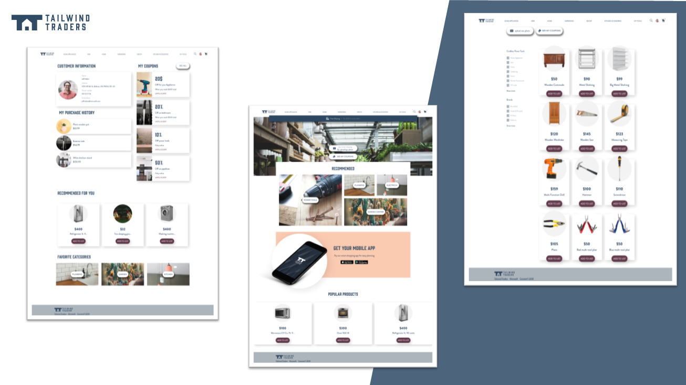
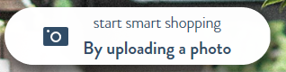
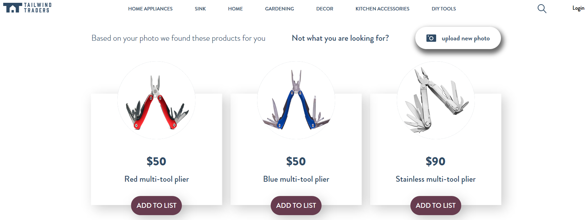
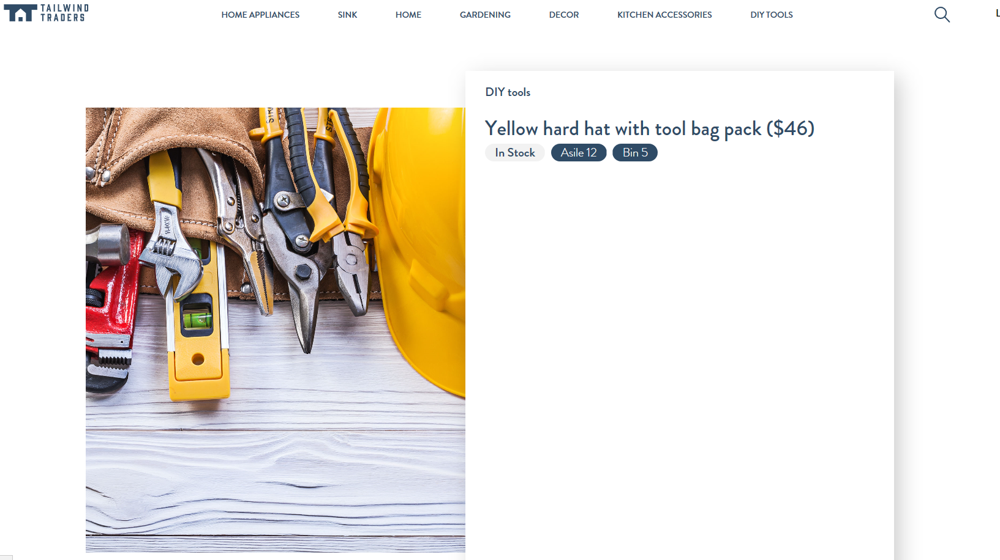

# Tailwind Traders Website



[](https://dev.azure.com/TailwindTraders/Website/_build?definitionId=22)

You can take a look at our live running website following this address: [https://tailwindtraders.com](https://tailwindtraders.com)

# Repositories

For this demo reference, we built several consumer and line-of-business applications and a set of backend services. You can find all repositories in the following locations:

- [Tailwind Traders](https://github.com/Microsoft/TailwindTraders)
- [Backend (AKS)](https://github.com/Microsoft/TailwindTraders-Backend)
- [Website (ASP.NET & React)](https://github.com/Microsoft/TailwindTraders-Website)
- [Desktop (WinForms & WPF -.NET Core)](https://github.com/Microsoft/TailwindTraders-Desktop)
- [Rewards (ASP.NET Framework)](https://github.com/Microsoft/TailwindTraders-Rewards)
- [Mobile (Xamarin Forms 4.0)](https://github.com/Microsoft/TailwindTraders-Mobile)

# Deploy to Azure

With the following ARM template you can automate the creation of the resources for this website.

[](https://portal.azure.com/#create/Microsoft.Template/uri/https%3A%2F%2Fraw.githubusercontent.com%2FMicrosoft%2FTailwindTraders-Website%2Fmaster%2FDeploy%2Fdeployment.json)

When you deploy this website to Azure you can define the [Backend](https://github.com/Microsoft/TailwindTraders-Backend) you want to use in case you have deploy your own backend. By defaults it is configured the public Backend environment provided by Microsoft.

> Note: you can change the InstrumentationKey of the **Application Insight** that is configured by default.

# Deploy as part of AKS (Azure Kubernetes Service)

Please follow these steps to deploy the web in the same AKS where Backend is running instead of deploying to an App Service.

**Note**: Website supports [Devspaces deployment](./Documents/Devspaces.md).

## Pre-Requisites:

1. **You must have an AKS with all the Tailwind Traders Backend Up & Running**. Please follow the instructions on [Tailwind Traders Backend repo](https://github.com/Microsoft/TailwindTraders-Backend/) to deploy the backend on AKS.

1. **You can't install the web on a AKS Before installing the Backend on it**. This is because some configuration steps that are done when installing the Backend are needed.

> Note: This document assumes you have the backend installed on an AKS and the `kubectl` is configured against this cluster.

## Build and push the docker image

You need to build & push the docker image for the web. You can use `docker-compose` for this task. You **must set two environment variables** before launching compose:

- `TAG`: Tag to use for the generated docker image.
- `REGISTRY`: Must be the login server of the ACR where Backend is installed.

Then you need to login into the ACR by typing: `docker login -u <username> -p <password> <acr-login-server>` where `<username>` and `<password>` are the ACR credentials.

Once logged in ACR you can build the web:

```
docker-compose build
```

And then you can push the images in ACR:

```
docker-compose push
```

## Deploy the image on the cluster using Helm

To deploy the web on the AKS you can use the `DeployWebAKS.ps1` script in `/Deploy` folder. This script have following parameters:

- `-aksName`: Name of the AKS (same AKS where Backend is)
- `-resourceGroup`: Resource group of the AKS
- `-acrName`: ACR where image is pushed. Has to be the same ACR where Backend images are.
- `-tag`: Tag to use for the Docker image of the Web
- `-valueSFile`: YAML files containing the values. Defaults to `gvalues.yaml`. You can use the provided `gvalues.yaml` as-is, so don't need to specify this parameter.
- `-b2cValuesFile`: YAML file with the B2C configuration values. Defaults to `values.b2c.yaml`. If B2C login is needed, you must fill the values in the file in order to configure it.
- `-tlsEnv`: TLS environment (staging or prod) that is installed in the cluster. Refer to the Backend repo for more information.
- `-appInsightsName`: Application Insights' name for monitoring purposes. 
  > **Note** The DeployWebAKS.ps1 uses, only if -appInsightsName is paseed, the _application-insights_ CLI extension to find the application insights id. Install it with `az extension add --name application-insights` if you pass it.

To install the web in AKS my-aks using production TLS certificates, located in resource group my-rg and using an ACR named `my-acr` you can type:

```
.\DeployWebAKS.ps1 -aksName my-aks -resourceGroup my-rg -acrName my-acr -tag latest -tlsEnv prod
```

# How to use the product search by photo

To use the product search, we need to upload a photo, the website redirects to suggested products showing 3 products or less, except if only suggest 1 product. When you have only 1 suggested product, the website redirects to detail of product.

Steps to search:

1. In home of the website, click in the "Start smart shopping" button.



2. Select a photo to upload and send it.
   - If website has more than 1 suggested products
     - Website redirect to suggested products.
   - If website has only a one suggested product.
     - Website redirects to details of product.

To use this search, you can use the images in:

- [Documents/Images/TestImages](Documents/Images/TestImages)

### Rechargable screwdriver sample

If you select the [Electric Screwdriver](Documents/Images/TestImages/electric_screwdriver.jpg) should be appears 3 suggested products similar to:


### Multi-tool plier sample

If you select the [Multi-Tool Plier](Documents/Images/TestImages/multi-tool_plier.jpg) should be appears 3 suggested products similar to:



### Hard hat sample

If you select the [Hard Hat](Documents/Images/TestImages/hard_hat.jpg) should be redirect to product detail, beacuse only have a 1 suggested product:



# Contributing

This project welcomes contributions and suggestions. Most contributions require you to agree to a
Contributor License Agreement (CLA) declaring that you have the right to, and actually do, grant us
the rights to use your contribution. For details, visit https://cla.microsoft.com.

When you submit a pull request, a CLA-bot will automatically determine whether you need to provide
a CLA and decorate the PR appropriately (e.g., label, comment). Simply follow the instructions
provided by the bot. You will only need to do this once across all repos using our CLA.

This project has adopted the [Microsoft Open Source Code of Conduct](https://opensource.microsoft.com/codeofconduct/).
For more information see the [Code of Conduct FAQ](https://opensource.microsoft.com/codeofconduct/faq/) or
contact [opencode@microsoft.com](mailto:opencode@microsoft.com) with any additional questions or comments.
