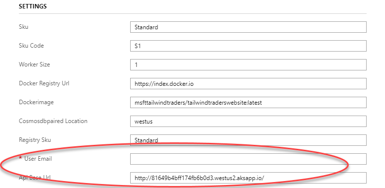

# Tailwind Traders Website Reference App

# Deploy to Azure

We have added an ARM template so you can automate the creation of the resources for this website.

>**Note**: You can deploy the website inside an AKS cluster. If you want to do so instead of deploying the web in App Service please, [check the documentation](./Deploy/deploy-on-aks.md)

When deploying to Azure pay attention to parameters `User Email` and `Api Base Url`. 

The first is the email of the logged user (not need to be a valid email, but MUST have email format).

The second is the base url where the [Backend](https://github.com/Microsoft/TailwindTraders-Backend) is installed. Defaults to the public test environment provieded by Microsoft.

# Run Locally

To run the web locally, please [read the documentation](./Documents/README.md)

# Repositories

For this demo reference, we built several consumer and line-of-business applications and a set of backend services. You can find all repositories in the following locations:

* [Tailwind Traders](https://github.com/Microsoft/TailwindTraders)
* [Backend (AKS)](https://github.com/Microsoft/TailwindTraders-Backend)
* [Website (ASP.NET & React)](https://github.com/Microsoft/TailwindTraders-Website)
* [Desktop (WinForms & WPF -.NET Core)](https://github.com/Microsoft/TailwindTraders-Desktop)
* [Rewards (ASP.NET Framework)](https://github.com/Microsoft/TailwindTraders-Rewards)
* [Mobile (Xamarin Forms 4.0)](https://github.com/Microsoft/TailwindTraders-Mobile)

# Contributing

This project welcomes contributions and suggestions.  Most contributions require you to agree to a
Contributor License Agreement (CLA) declaring that you have the right to, and actually do, grant us
the rights to use your contribution. For details, visit https://cla.microsoft.com.

When you submit a pull request, a CLA-bot will automatically determine whether you need to provide
a CLA and decorate the PR appropriately (e.g., label, comment). Simply follow the instructions
provided by the bot. You will only need to do this once across all repos using our CLA.

This project has adopted the [Microsoft Open Source Code of Conduct](https://opensource.microsoft.com/codeofconduct/).
For more information see the [Code of Conduct FAQ](https://opensource.microsoft.com/codeofconduct/faq/) or
contact [opencode@microsoft.com](mailto:opencode@microsoft.com) with any additional questions or comments.
