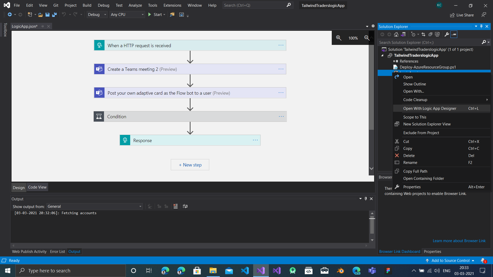
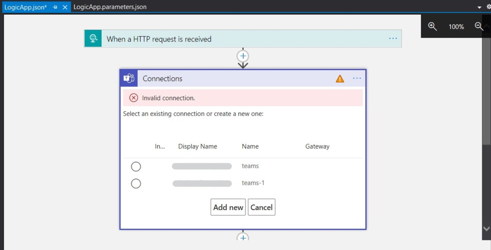

# Tailwind Traders Logic App
A logic app to schedule and send meeting invite to customer via SMS and to customer representative via Flow bot.

## Pre-Requisites
- Visual Studio 2015 or above with Azure Dev Kit
- [Logic App Tools extension for Visual Studio](https://marketplace.visualstudio.com/items?itemName=VinaySinghMSFT.AzureLogicAppsToolsForVS2019)

## Setup the template to use your Azure resources
- Open the solution in Visual Studio
- In the solution explorer right click and open with Logic App Designer

- Click on the logic app steps with a warning symbol (⚠) and configure to connect with your existing connection or add new.


## Deploy Logic App to Azure
- Right click on the solution and select deploy
- Select or create a resource group where you want to deploy the logic app.
- Click on deploy and when prompted for parameters enter values from your Azure Resource group page then click save
- A powershell script runs, when prompted to enter connection id enter the value obtained from the Azure portal and hit enter.
- The Logic app is then deployed to the specified resource group.

## Using the Logic App
To use the Logic App send a HTTP request with a request body in the following format to the URL in the HTTP request step in the Logic App
```
{
    "email": "<EMAIL>",
    "headline": "<MEETING_TITLE>",
    "summary": "<MEETING_SUMMARY>",
    "isVideoCall": "<BOOL_VALUE_FOR_TYPE_OF_INTERACTION>"
    "webAppMeetingDomain": "localhost:3000",
    "text": "<MEETING_INFO_FOR_FLOW_BOT_ADAPTIVE_CARD>",
    "userPhone": "<USER_PHONE>"
 }
```